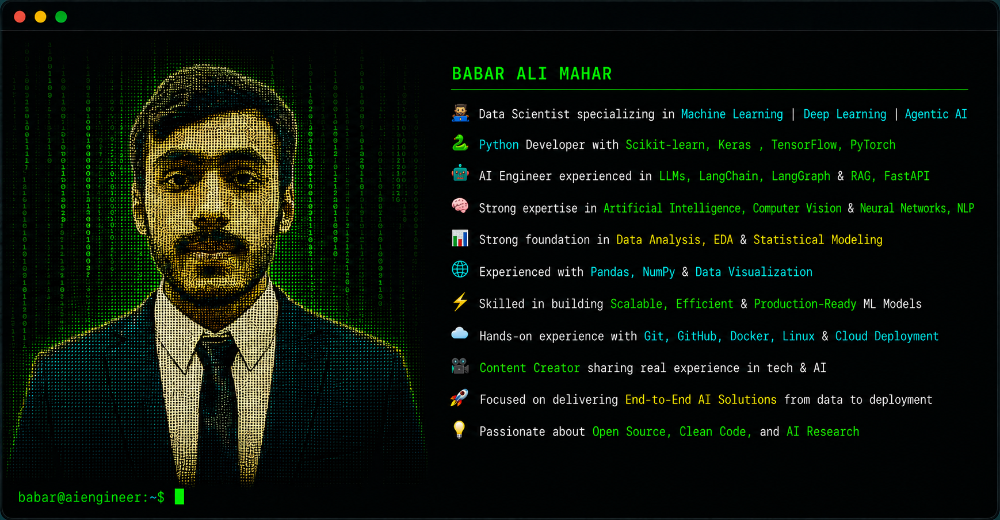

<h1 align="center">Hi 👋, I'm Babar Ali Mahar</h1>

<code>Turning data into decisions, and ideas into intelligent systems.</code>

---

# 🌐 Connect With Me

---

# 💻 Programming Languages

  

---

# 🤖 Machine Learning & Deep Learning

  

- 🧠 Machine Learning (Regression, Classification, Clustering)
- 🔬 Deep Learning (CNNs, RNNs, Transfer Learning)
- 🖼️ Computer Vision
- 📊 Model Evaluation & Hyperparameter Tuning
- 🧩 Scikit-learn, TensorFlow & PyTorch

---

# 🧬 AI Engineering

- 🤖 Large Language Models (LLMs)
- 🔗 LangChain & LangGraph
- 📚 Retrieval-Augmented Generation (RAG)
- ⚡ Agentic AI Systems
- 🧠 Prompt Engineering
- 🛠️ AI Automation
- ☁️ LLMops

---

# 📊 Data Science & Analysis

  

- 🧮 Exploratory Data Analysis (EDA)
- 📈 Data Visualization (Matplotlib, Seaborn)
- 🐼 Pandas & NumPy
- 📉 Statistical Analysis

---

# 🗄️ Databases & Tools

  

---

# ☁️ Deployment & Cloud

  

---

# 💬 Quote

> **"Learn with intention. Build with discipline. Share what you know."**

---

## ⭐ Support My Work

If you find my work valuable:

⭐ Star my repositories

🤝 Let's connect and build something impactful together!
